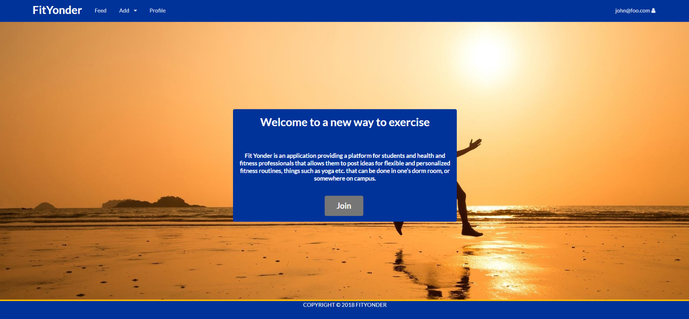
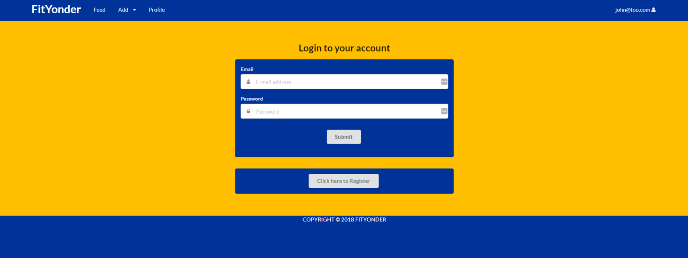
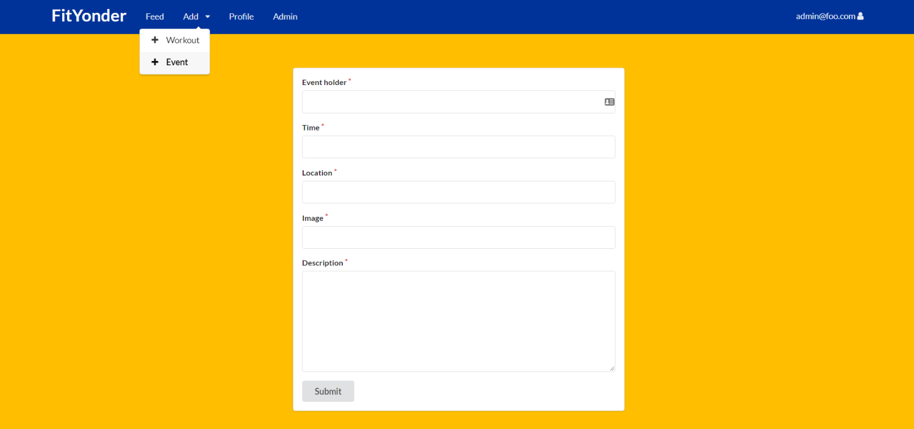
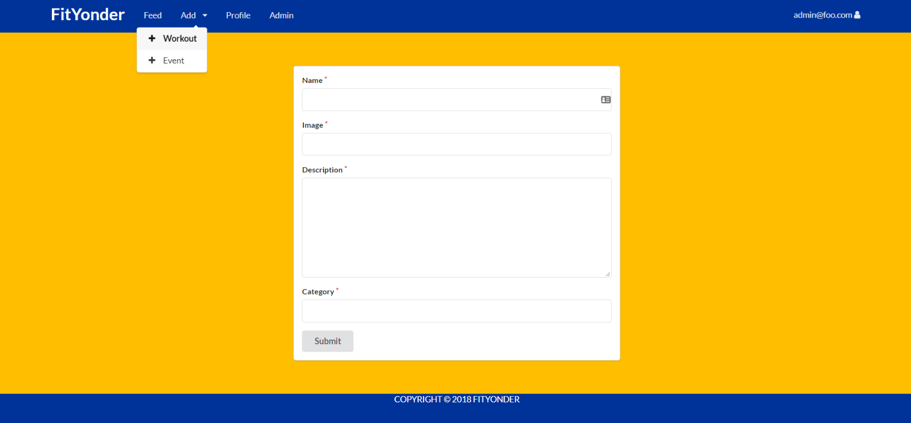
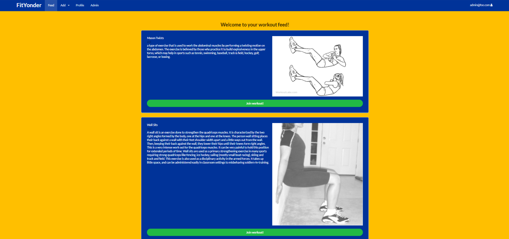
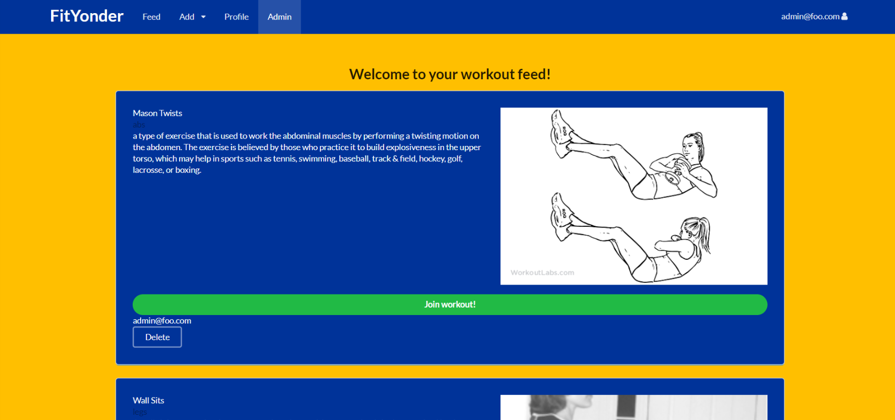
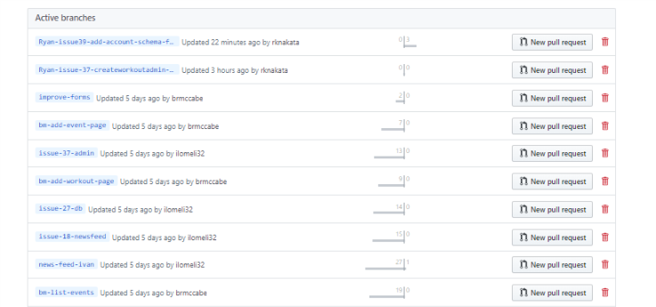

# Visit us
<a href="http://fityonder.meteorapp.com/">http://fityonder.meteorapp.com/</a>


# About Fit Yonder

Fit Yonder is an application providing a platform for students and health and fitness professionals that allows them to post ideas for flexible and personalized fitness routines, things such as yoga etc. that can be done in one’s dorm room, or somewhere on campus.  When you come to the site, you are greeted by the following landing page:


It can be difficult to fit a consistent fitness routine into an already packed college student schedule. Many people are intimidated by the idea of going to the gym to work-out. Also, the hours of the gym on campus sometimes don’t work out for a variety of schedules.

Students are able to post their fitness goals and/or other constraints which can then be matched against the fitness routines available in on Fit Yonder. Fit Yonder can also enable students to log their time, frequency of workouts, and other measures of progress. Fit Yonder's workout page lists which routines are popular based provide user-generated reviews and completions.

# User Guide

>FitYonder is currently under developement. If you would like to test out our web app feel free to sign in with one of our test accounts.

Admin:
username: admin@foo.com
password: changeme

User:
username: john@foo.com
password: changeme

Anyone with a UH account can login to Fit Yonder by clicking on the login button. The UH CAS authentication screen then appears and requests your UH account and password: (pending implementation)
 

 
Once authenticated, you can create a profile that provides a biographical statement and list of interests, plus links to selected social media sites (GitHub, FaceBook, Instagram):


  
After creating a profile, you will be listed on the members page:


Fityonder also provides a filter page, available to those who can login to the system with their UH account. The filter page allows you to display all portfolios with a given interest(yoga, running, gym, etc):


# Application Design

## Landing Page

The landing page is the first page that users will be greated when our url is entered.

## Workouts Page

The workouts page lists all the avaialable workouts that are on the site. There will be options to sort the page by user rating, completeion. The user is also able to add a new workout session to the page. Pending an admins approval other users will then be able to request permision to join in with the original posters workout.
 
## Profile Page

This is the users profile where interests and achievments will be displayed.

## Login And Signup Page

Here UH students are able to login to their accounts or signup.

# Installation
First, [install Meteor](https://www.meteor.com/install).

Second, [clone our repository](https://github.com/Fit-Yonder/fit-yonder).
  
Third, cd into the app/ directory and install libraries with:

```
$ meteor npm install
```

Fourth, run the system with:

```
$ meteor npm run start
```

If all goes well, the application will appear at [http://localhost:3000](http://localhost:3000). If you have an account on the UH test CAS server, you can login.  

# Development History

The development process for Fit Yonder conformed to [Issue Driven Project Management](http://courses.ics.hawaii.edu/ics314f16/modules/project-management/) practices. In a nutshell, development consists of a sequence of Milestones. Milestones consist of issues corresponding to 2-3 day tasks. GitHub projects are used to manage the processing of tasks during a milestone.  

The following sections document the development history of Fit Yonder.

## Milestone 1: Mockup development

This milestone started on December 6, 2016 and ended on January 31, 2017.

The goal of Milestone 1 was to create a set of HTML pages providing a mockup of the pages in the system. To simplify things, the mockup was developed as a Meteor app. This meant that each page was a template and that FlowRouter was used to implement routing to the pages. 

Mockups for the following four pages were implemented during M1:


Milestone 1 was implemented as [Fit Yonder GitHub Milestone M1](https://github.com/Fit-Yonder/fit-yonder/projects/1)::


Milestone 1 consisted of five issues, and progress was managed via the [Fit Yonder GitHub Project M1](https://github.com/Fit-Yonder/fit-yonder/projects/1):


Each issue was implemented in its own branch, and merged into master when completed:


## Milestone 2: Data model development 

This milestone started on Jan 31, 2017 and ended on Feb 2, 2017.

The goal of Milestone 2 was to implement the data model: the underlying set of Mongo Collections and the operations upon them that would support the  application.  We implemented the data model as a set of Javascript classes. The BaseCollection class provides common fields and operations. The ProfileCollection and InterestCollection classes inherit from BaseCollection and provide the persistent data structures useful for BowFolios. 
 
Also in this milestone, we implemented a set of mocha tests for the data model classes. These tests make sure we can create, manipulate, and delete the data model documents successfully.  These tests are documented above.

Milestone 2 was implemented as [Fit Yonder GitHub Milestone M2](https://github.com/Fit-Yonder/fit-yonder/projects/2)::


Milestone 2 consisted of two issues, and progress was managed via the [Fit Yonder GitHub Project M2](https://github.com/orgs/Fit-Yonder/projects/4):








Each issue was implemented in its own branch, and merged into master when completed:



## Milestone 3: Connect UI to data model

lorem ipsumThis milestone started on April 24, 2018 and ended on May 4, 2018.

lorem ipsumThe goal of Milestone 3 was to connect the user interface to the underlying data model. This meant that we updated the templates for each page with calls to helper functions, and we created Javascript files for the templates with helper functions. We used the form control templates from [meteor-example-form](https://ics-software-engineering.github.io/meteor-example-form/) to simplify implementation of form processing.

Milestone 3 was implemented as [Fit Yonder GitHub Milestone M3](https://github.com/Fit-Yonder/fit-yonder/projects/4)::


Milestone 3 consisted of four issues, and progress was managed via the [Fit Yonder GitHub Project M3](https://github.com/Fit-Yonder/fit-yonder/projects/4):


Each issue was implemented in its own branch, and merged into master when completed:


# Community Feedback

## Creighton

Fit Yonder is a great helper for random convenient workouts anywhere with a nice user friendly looking website.

## Person 2

lorem ipsum

## Person 3

lorem ipsum

## Person 4

lorem ipsum

## Person 5

lorem ipsum


